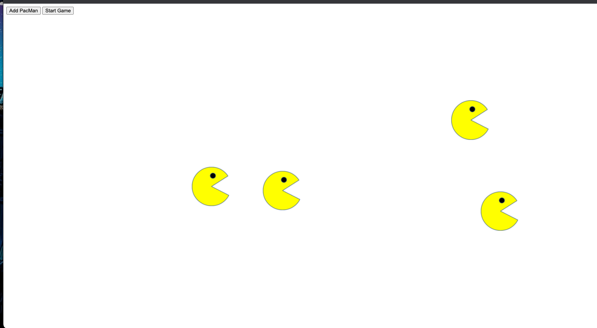

# PACMAN EXERCISE

##Table of Contents
- [Project Description](#project-description)
- [How to use the realtime bus tracker](#how-to-use)
- [Licenses](#licenses)

## Project Description
the Pacman Exercise utilizes recursive functions to check the playgoround boundaries as well as timeout to move the pacmans you produce. It demonstrates the ability to use the DOM to control objects, in this case a PacMen.

## How to use
this game is relaitvely easy to use. simply drag and drop the index.html into your browser and press "Add PacMan". you can add multiple pacman prior to the game and/or while playing the game. to start moving the PacMan, simply press "Strt Game"

1. Open the keys.js file and insert your API key into the "YOUR_API_KEY_GOES_HERE" section. ONce you have copy and pasted your key, save and close the file
2. Open the index.html file in your browser
3. Enjoy the app and track all buses within boston in realtime

## Licenses
All content and licenses have been granted to me by MIT. I do not own any of the content unless explicitly stated.