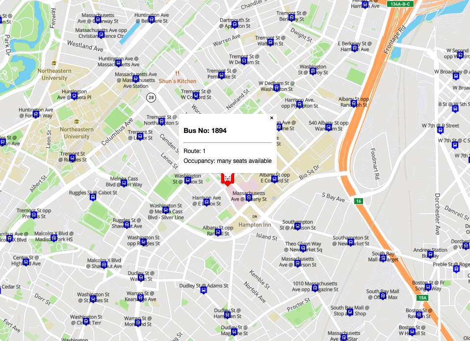

# REAL TIME BUS TRACKER

##Table of Contents
- [Project Description](#project-description)
- [How to use the realtime bus tracker](#how-to-use)
- [Licenses](#licenses)

## Project Description
The Realtime Bus tracker app is based on a mapbox streetview map for the city of Boston. It allow you to track all buses within the City of Boston in realtime, including their status and available number of seats.

## How to use
In order to use the realtime bus tracker, you need a Mapbox API key. To obtain a mapbox API key, please click [here](https://www.mapbox.com/). If you have a mapbox API key, please follow along with below instructions:

1. Open the keys.js file and insert your API key into the "YOUR_API_KEY_GOES_HERE" section. ONce you have copy and pasted your key, save and close the file
2. Open the index.html file in your browser
3. Enjoy the app and track all buses within boston in realtime

## Licenses
All content and licenses have been granted to me by MIT. I do not own any of the content unless explicitly stated.